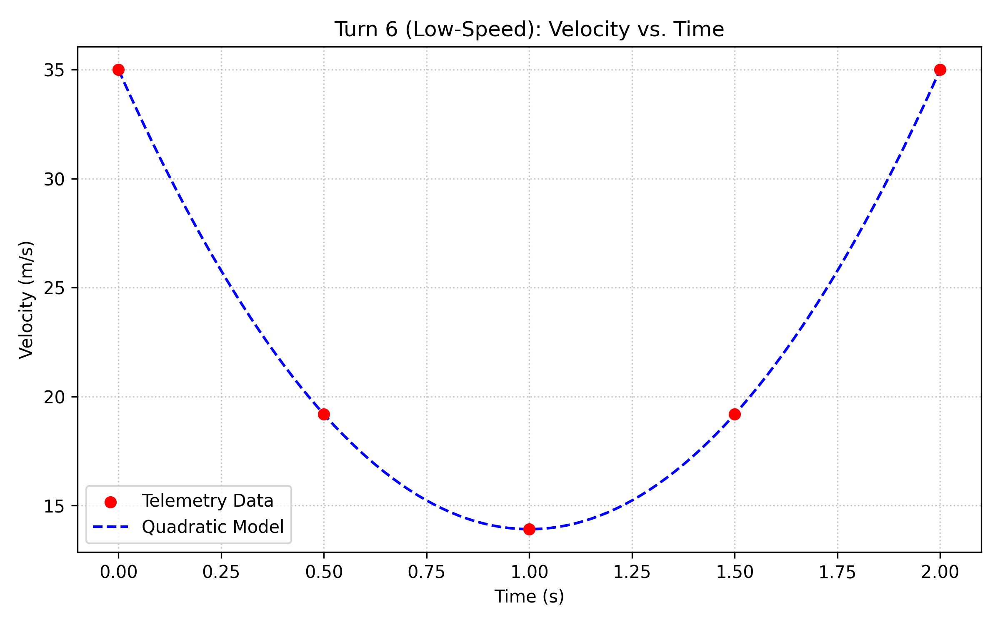
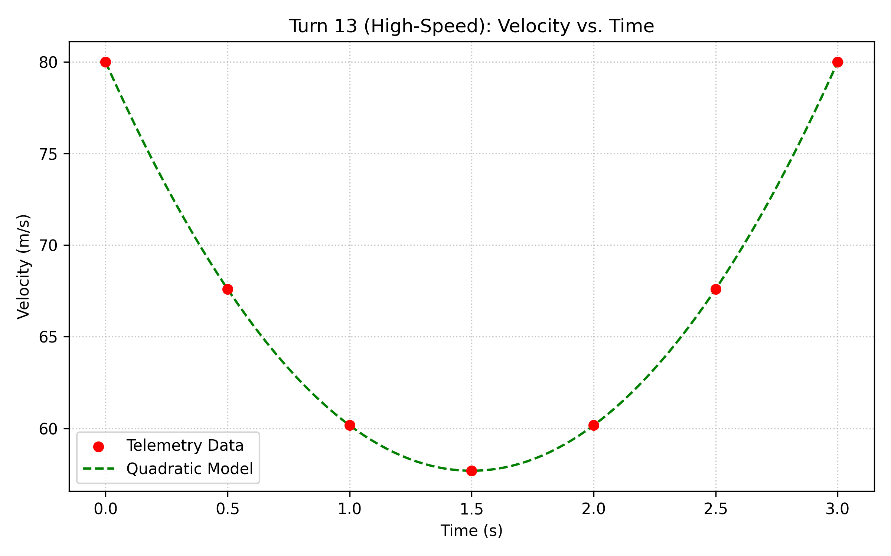
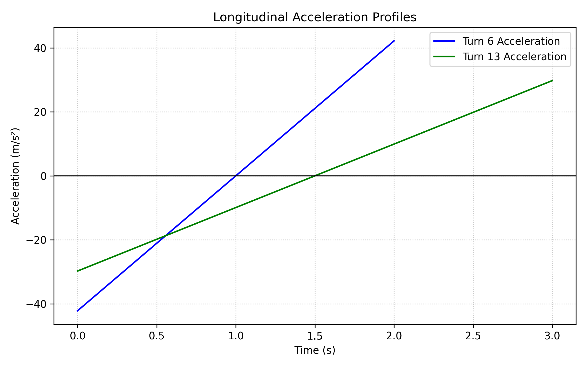

# 🏎️ Formula 1 Telemetry Analysis: Quadratic Modeling of Cornering Profiles

> A comparative mathematical framework analyzing vehicle kinematics across a low-speed mechanical corner (Turn 6) and a high-speed aerodynamic corner (Turn 13).

## 📊 Overview
This project isolates telemetry captures from two distinct curves to analyze how an F1 car's speed responds to different geometric profiles. Utilizing telemetry data from Lando Norris on Lap 7, we derive separate quadratic functions via vertex systems, perform derivative comparisons for longitudinal acceleration profiles, and use numerical integration to isolate the respective time performance losses.

---

## 🗃️ The Telemetry Dataset
The data represents high-frequency captures isolating the entry, apex, and exit stages of both corners at fixed intervals of h = 0.5 s.

| Turn Location | Time t (s) | Velocity v(t) (m/s) | Corner Phase Status |
| :--- | :--- | :--- | :--- |
| **Turn 6 (Slow)** | 0.0 | 35.000 | Corner Entry |
| **Turn 6** | 1.0 | 13.914 | Corner Apex (Minimum Speed) |
| **Turn 6** | 2.0 | 35.000 | Full Exit Recovery |
| **Turn 13 (High)** | 0.0 | 80.003 | Corner Entry |
| **Turn 13** | 1.5 | 57.683 | Corner Apex (Minimum Speed) |
| **Turn 13** | 3.0 | 80.003 | Full Exit Recovery |

---

## 🧮 Algebraic Derivation & Modeling
We modeled the velocity for both corners using distinct quadratic models: `v(t) = at^2 + bt + c`.

### Turn 6: Low-Speed Mechanical
Turn 6 features an empirical minimum apex speed of 13.914 m/s at 1.0 s. Using the boundary entry coordinate (0.0, 35.000), the expanded standard form is:
`v_6(t) = 21.086t^2 - 42.172t + 35.000`

### Turn 13: High-Speed Aerodynamic
Turn 13 features an empirical minimum apex speed of 57.683 m/s at 1.5 s. Using the boundary entry coordinate (0.0, 80.003), the expanded standard form is:
`v_13(t) = 9.920t^2 - 29.760t + 80.003`

---

## 📉 Differential Analysis: Acceleration
Differentiating both continuous velocity functions yields the instantaneous longitudinal acceleration equations (`a_x(t) = v'(t)`):
* **Turn 6:** `a_{x,6}(t) = 42.172t - 42.172`
* **Turn 13:** `a_{x,13}(t) = 19.840t - 29.760`

Evaluating at corner entry (t = 0), Turn 6 experiences a peak braking force of -42.172 m/s^2 (approx -4.3g) whereas Turn 13 experiences -29.760 m/s^2 (approx -3.0g). This highlights that the lower-speed corner requires a much steeper deceleration profile due to the tighter turning radius.

---

## ⏱️ Numerical Integration & Time Lost
Using the Trapezoidal Rule with step interval h = 0.5 s, we calculated the total distance (d) of each corner zone to evaluate performance degradation:

* **Turn 6 Metrics:** The total distance is approx 51.14 m. The ideal straight-line baseline time is approx 1.461 s. The total time lost is **0.539 s**.
* **Turn 13 Metrics:** The total distance is approx 200.00 m. The ideal straight-line baseline time is approx 2.500 s. The total time lost is **0.500 s**.

---

## 💡 Conclusion
Even though Turn 13 operates at speeds nearly four times higher than Turn 6, it accounts for a very similar time penalty (approx 0.50 s). This indicates that high-speed corner momentum management is mathematically as critical to an optimal lap time as executing severe braking zones in low-speed hairpins.
